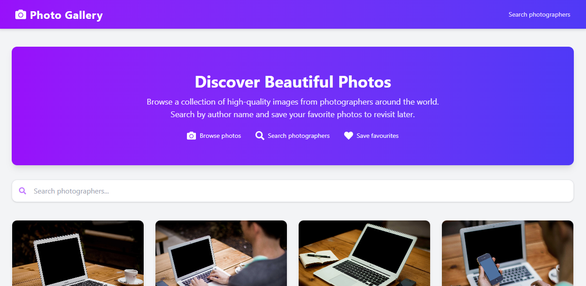

#  Photo Gallery App

A responsive **Photo Gallery Web App** built using **React + Vite +
Tailwind CSS**. The application fetches photos from the Picsum API,
displays them in a responsive grid, allows searching by author name, and
lets users mark photos as favourites.

------------------------------------------------------------------------

##  Features

-   Fetch photos from a public API
-   Responsive photo grid layout
-   Search photos by author name
-   Mark/unmark photos as favourites
-   Favourite photos persist after page refresh using localStorage
-   Loading spinner while fetching data
-   Error handling if API fails
-   Clean and modular React architecture

------------------------------------------------------------------------

## 🖼️ Application Screenshot



------------------------------------------------------------------------

##  Tech Stack

### Frontend

-   React (Vite)
-   Tailwind CSS

### React Hooks Used

-   useState
-   useReducer
-   useEffect
-   useCallback
-   useMemo

------------------------------------------------------------------------

##  API Used

Picsum Photos API

    https://picsum.photos/v2/list?limit=30

This API returns a list of images along with metadata like author name
and image URL.

------------------------------------------------------------------------

## 📂 Project Structure

    src
    │
    ├── components
    │   ├── gallery
    │   │   ├── PhotoCard.jsx
    │   │   ├── PhotoGrid.jsx
    │   │   └── SearchBar.jsx
    │   │
    │   ├── layout
    │   │   ├── Navbar.jsx
    │   │   └── Footer.jsx
    │   │
    │   └── ui
    │       ├── Loader.jsx
    │       ├── ErrorMessage.jsx
    │       └── ImageSkeleton.jsx
    │
    ├── hooks
    │   └── useFetchPhotos.js
    │
    ├── reducers
    │   └── favouritesReducer.js
    │
    ├── pages
    │   └── GalleryPage.jsx
    │
    ├── App.jsx
    ├── main.jsx
    └── index.css

------------------------------------------------------------------------

##  Installation

### 1. Clone the repository

``` bash
git clone https://github.com/your-username/photo-gallery.git
```

### 2. Navigate to the project directory

``` bash
cd photo-gallery
```

### 3. Install dependencies

``` bash
npm install
```

### 4. Start the development server

``` bash
npm run dev
```

The application will run at:

    http://localhost:5173

------------------------------------------------------------------------

## 📌 Key Implementation Details

### Custom Hook

`useFetchPhotos`

This hook is responsible for:

-   Fetching photos from the API
-   Managing loading state
-   Handling API errors

The hook returns:

    photos
    loading
    error

------------------------------------------------------------------------

### useReducer for Favourites

The favourites state is managed using **useReducer** instead of
useState.

Reducer actions:

    TOGGLE_FAV

When a user clicks the heart icon:

-   The photo is added to favourites
-   Clicking again removes it

Favourite photos are saved in **localStorage**, so they persist even
after refreshing the page.

------------------------------------------------------------------------

### Performance Optimization

#### useCallback

Used for the search handler to prevent unnecessary re-renders when
passing the function to child components.

#### useMemo

Used to compute the filtered photo list efficiently.

Filtering runs only when:

-   photos change
-   search query changes

------------------------------------------------------------------------

## 👨‍💻 Author

Built by **Lalit Mehra** as part of a **Frontend React Internship
Assignment**.

------------------------------------------------------------------------

## 📄 License

This project is created for educational and assignment purposes.
